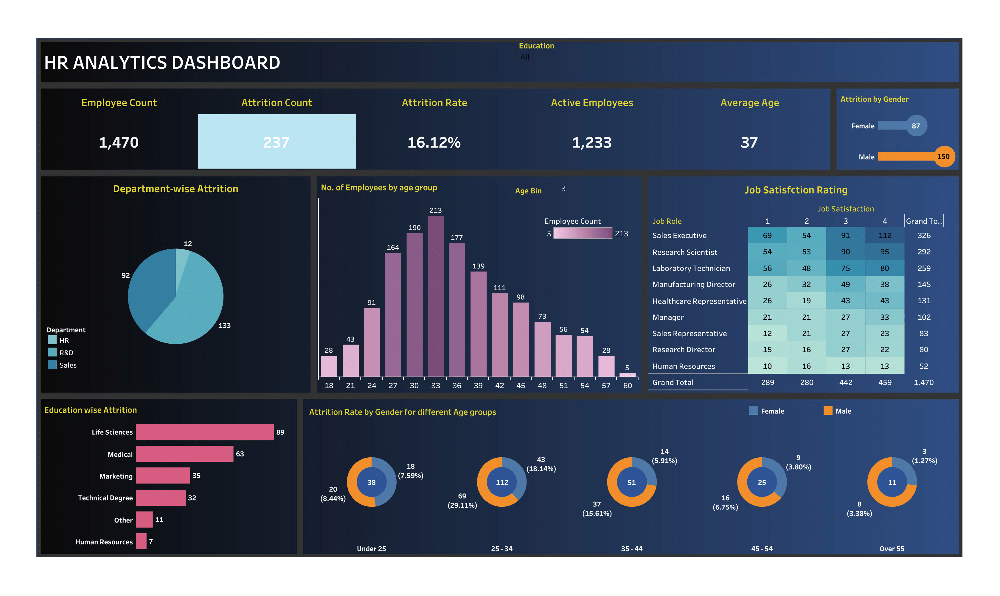

## Datacraft🧑‍💼 HR Analytics Dashboard
### 📊 Overview
This project explores HR data to uncover insights related to employee retention, satisfaction, and performance. I used SQL for data cleaning and analysis, and built a Tableau dashboard to visualize key metrics and trends.

### 🔍 Objectives
Understand patterns behind employee attrition

Analyze relationships between features like attrition rate, gender and age.

Create an interactive dashboard for stakeholders to make data-driven HR decisions

### 🛠️ Tools & Skills Used
SQL – Data exploration, filtering, joins

Tableau – Interactive dashboard, charts, and filters

### 🎯 Key Learnings
Writing efficient SQL queries

Designing clean, intuitive dashboards using Tableau

Understanding how data can help HR make informed decisions

### 🚀 How to Use
Download the .twbx file with the dataset from this repo and open in Tableau Desktop

